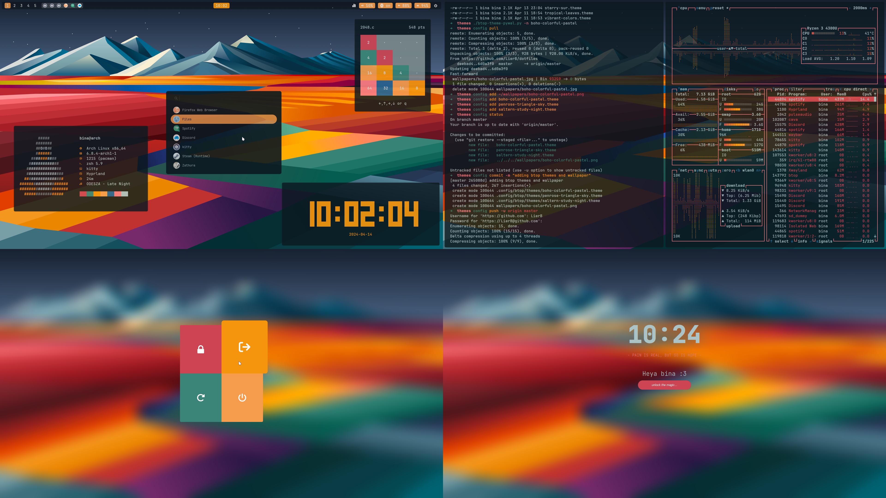
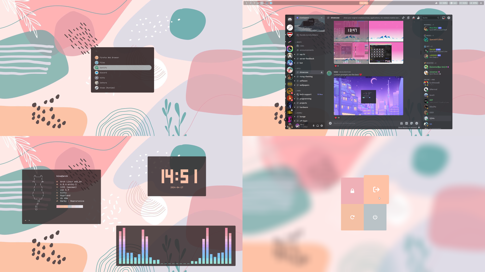
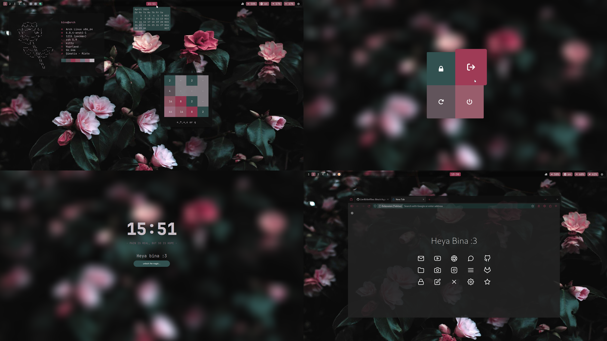
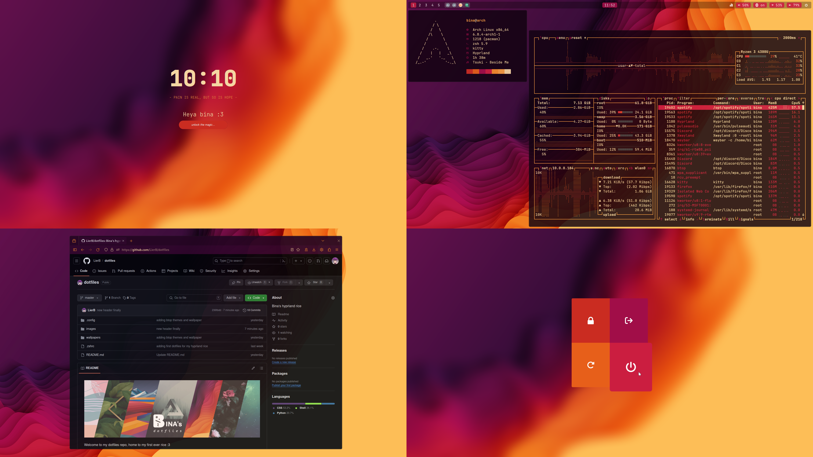

<h3 align="left">
Welcome to my Hyprland Dotfiles
</h3>

## Installation

- See the [arch-base install guide](https://github.com/yokoszn/arch/blob/main/README.md) on setting up a minimal base-install.
- See the [dotfiles install guide](https://github.com/yokoszn/hyprdots/blob/master/installation.md) on how to install this yourself.

An automatic dotfiles install script will follow.

<div align="left">
<br>
  <a href="#packages"><kbd> <br> Packages <br> </kbd></a>&ensp;&ensp;
  <a href="#showcase"><kbd> <br> Showcase <br> </kbd></a>&ensp;&ensp;
  <a href="#installation"><kbd> <br> Installation <br> </kbd></a> <br>
</div>


## Packages
list of main programs, applications, tools and themes that I use for my rice
| component           | resource  
| :---------          | :-------  
| window manager      | [hyprland](https://github.com/hyprwm/Hyprland)
| color theme         | [pywal](https://github.com/dylanaraps/pywal)
| terminal emulator   | [kitty](https://github.com/kovidgoyal/kitty)
| shell               | [zsh](https://github.com/ohmyzsh)
| fetch displayer     | [fastfetch](https://github.com/fastfetch-cli/fastfetch) (or [neofetch](https://github.com/dylanaraps/neofetch))
| resource monitor    | [btop](https://github.com/aristocratos/btop)
| bar                 | [waybar](https://github.com/Alexays/Waybar)
| logout menu         | [wlogout](https://github.com/ArtsyMacaw/wlogout)
| lockscreen          | [hyprlock](https://github.com/hyprwm/hyprlock)
| idle daemon         | [hypridle](https://github.com/hyprwm/hypridle)
| app launcher        | [wofi](https://hg.sr.ht/~scoopta/wofi)
| wallpaper daemon    | [swww](https://github.com/LGFae/swww)
| screenshot tool     | [grimblast](https://github.com/hyprwm/contrib/tree/main/grimblast)
| cursor              | [Rosé Pine Dawn](https://github.com/rose-pine/cursor)
| icons               | [Ketsa](https://github.com/zayronxio/ketsa-icon-theme) & [Reversal](https://github.com/yeyushengfan258/Reversal-icon-theme)
| font                | [JetBrains Mono](https://github.com/JetBrains/JetBrainsMono)
| document viewer     | [zathura](https://github.com/pwmt/zathura)
| audio visualizer    | [cava](https://github.com/karlstav/cava)
| terminal clock      | [tty-clock](https://github.com/xorg62/tty-clock)
| terminal games      | [snake](https://github.com/PonasKovas/snake) & [2048](https://github.com/mevdschee/2048.c)

---
# Showcase
### Penrose triangle forest
<p align="center">
  
</p>

### Saltern study night
<p align="center">
  
</p>

### Boho colorful pastel
<p align="center">
  
</p>

### Tropical leaves
<p align="center">
  
</p>

### Penrose triangle sky
<p align="center">
  
</p>

### Moody flowers
<p align="center">
  
</p>

### Vibrant colors
<p align="center">
  
</p>

<details style="margin-bottom: 20px;">

---
  
<summary>plans... </summary>


I intend to implement the following tools in the (near) future:<br/>

| component           | resource  
| :---------          | :-------  
| login menu          | [sddm](https://github.com/sddm/sddm) 
| notifications daemon | [dunst](https://github.com/dunst-project/dunst)
| text/code editor    | [neovim](https://neovim.io/) and [code-oss](https://github.com/microsoft/vscode)
| typing test tool    | [tt](https://github.com/lemnos/tt) or [monk-minl](https://github.com/shikhar13012001/monk-minal)

---

## Miscellanous

Laptop Brightness & Lid Switch
```
bindel = ,XF86MonBrightnessUp, exec, brightnessctl s 10%+
bindel = ,XF86MonBrightnessDown, exec, brightnessctl s 10%-
bindl=,switch:off:Lid Switch,exec,hyprctl keyword monitor "eDP-1, preferred, auto, auto"
bindl=,switch:on:Lid Switch,exec,hyprctl keyword monitor "eDP-1, disable"
```
Laptop Brightness: Pressing the dedicated brightness keys (XF86MonBrightnessUp/Down) calls brightnessctl. Adjust the percentage values to your preference.
Lid Switch: Disables or re-enables eDP-1 monitor. --- f you’re on a desktop, you can remove these.

Basic Window Navigation
```
SUPER + Q: Closes (kills) the currently active window.
SUPER + Shift + V: Pins a window to stay on top.
SUPER + Shift + C: Centers the active window on screen.
Alt + Return: Toggles fullscreen on the active window.
SUPER + Tab: Toggles whether the active window floats or tiles.
SUPER + R: Toggles the window’s split orientation (horizontal/vertical).
```

Scratchpad
These lines define scratchpad-like workspaces named overview and running.
``
SUPER + ~ `` toggles the special workspace named overview.
Typically, code:49 maps to the key above Tab ``(~ / \`` on some keyboards), but confirm your own keycodes with `wev` or similar.

Scrolling Between Workspaces
```
SUPER + Scroll: Cycles through available workspaces (scroll up or down).
SUPER + Left Mouse Button (hold & drag): Moves the active window.
SUPER + Right Mouse Button (hold & drag): Resizes the active window.
SUPER + Shift + Arrow: Moves the window in that direction.
SUPER + Arrow: Resizes the active window (width/height changes).
```
---
# To Do
 - [ ] yubi-key for MFA with decryption with encrypted boot partition.
 - [ ] headless encrypted disk setup guide - bootloader on seperate drive, e.g. USB or microSD card
 - [ ] Screenshots
